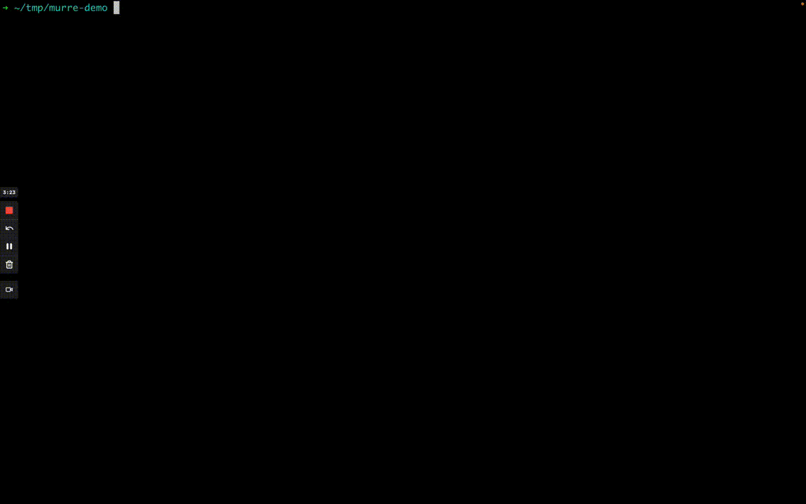

# murre - K8s on demand metrics, free of third-party dependencies

## Demo

## What is murre?
murre is a on-demand, scaleable source of container resource metrics for K8s.

murre fetchs resource metrics directly from the kubelet on each K8s Node. murre also enrich the resources with the relevant limits from each PodSpec.

## What is murre useful for?
- Detect pods and containers with high cpu/memory utilization
- Find out how much of cpu and memory does specific pod consumes

## Why murre?
somtimes, you just want to go simple. stateless. minimil as possible like murre.